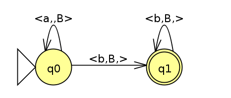

# Automato de Pilha

Projeto criado para o trabalho prático da matéria de automotos.

Para executar um automato é necessário criar um arquivo com o alfabeto, estados e transições;

Exemplo:
Automato de duplo balanceamento.



Deve criar um arquivo no seguinte formato:
```
a;b
q0,i;q0,,B;q1,B
q1,f;;q1,B
```
Legenda:
- 'a' e 'b' são as letras que compõe o alfabeto da linguagem.
- q0 e q1 São estados
- 'i' e 'f' São parametros dos estados, indicam respectivamente se o estado é incial e/ou final
- 'B' indica o que se deve empilhar/desempilhar da pilha.
  - Se quiser adicionar mais de um item para empilhar/desempilhar
  - Basta separar os mesmos por '-'. Ex: q0,B-A,; vai pra q0, desempilha B e depois A.